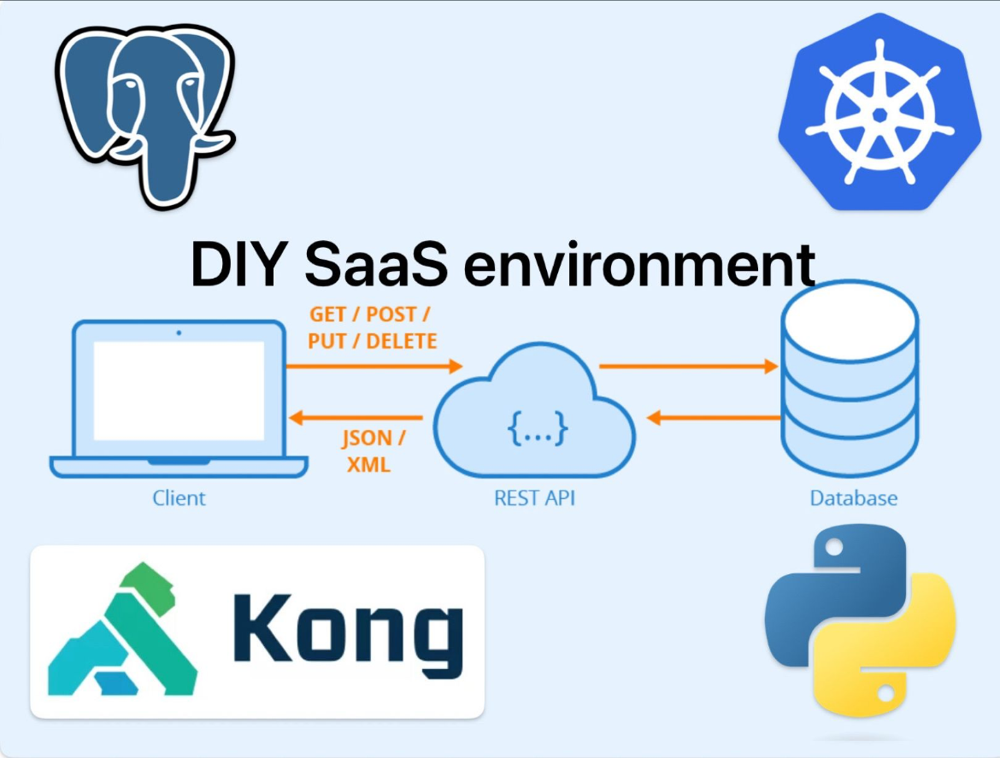

# DIY SaaS Environment



[**Cleuton Sampaio**](http://cleutonsampaio.com)

O mercado de **SaaS** (Software as a Service) é muito lucrativo e cheio de oportunidades e pode ser classificado como: 

- **Horizontal**: Produtos que buscam uma grande base de usuários.
- **Vertical**: Produtos que buscam um "nicho" de usuários. 
- **API**: Produtos que servem de subsídios para outros produtos e negócios.
- **Apps**: Produtos que possuem interface de usuário. 

Seja como for, um negócio SaaS tem alguns fatores críticos de sucesso a considerar: 

1. Qualidade do Software: O software SaaS deve ser confiável, rápido, seguro e livre de bugs. A qualidade do produto é fundamental para manter os clientes satisfeitos.

2. Modelo de Preços Competitivo: Ter um modelo de preços flexível e competitivo é importante para atrair e reter clientes. Isso pode incluir opções de preços mensais, anuais ou por usuário, dependendo do público-alvo.

3. Experiência do Usuário: Uma interface de usuário intuitiva e amigável é crucial para garantir que os clientes possam usar o software facilmente, sem a necessidade de treinamento extensivo.

4. Suporte ao Cliente: Oferecer um suporte eficaz e rápido é fundamental para resolver problemas dos clientes e garantir sua satisfação. Isso pode incluir suporte por telefone, chat ao vivo ou e-mail.

5. Atualizações e Manutenção Contínuas: Manter o software atualizado com novos recursos, correções de segurança e melhorias é importante para manter os clientes engajados e satisfeitos.

6. Segurança de Dados: Garantir a segurança dos dados dos clientes é essencial, especialmente se o software lida com informações confidenciais. Isso inclui criptografia, medidas de proteção de dados e conformidade com regulamentações de privacidade.

7. Escalabilidade: O software SaaS deve ser capaz de escalar para acomodar o crescimento dos clientes sem comprometer o desempenho.

8. Marketing e Aquisição de Clientes: Ter estratégias de marketing eficazes para atrair novos clientes é crucial para o sucesso de um negócio SaaS. Isso pode incluir publicidade online, marketing de conteúdo e estratégias de SEO.

9. Retenção de Clientes: Além de atrair novos clientes, é importante manter os clientes existentes. Programas de fidelidade, suporte contínuo e atualizações regulares podem ajudar a manter os clientes satisfeitos.

10. Parcerias Estratégicas: Estabelecer parcerias estratégicas com outras empresas pode ajudar a expandir o alcance do seu software e alcançar novos mercados.

11. Análise de Dados e Métricas: Acompanhar métricas-chave, como taxas de churn (perda de clientes), taxa de conversão e receita recorrente, é fundamental para avaliar o desempenho e tomar decisões informadas.

12. Conformidade Regulatória: Certificar-se de que o software esteja em conformidade com regulamentações específicas da indústria ou geografia em que atua é importante para evitar problemas legais.

Em se tratando de **API**, ainda podemos adicionar: 

1. Documentação Completa: Ter uma documentação clara e abrangente das APIs é crucial para que os desenvolvedores possam integrar facilmente suas aplicações com o seu serviço.

2. Facilidade de Integração: As APIs devem ser projetadas para serem fáceis de integrar, com SDKs (Software Development Kits) e bibliotecas que simplificam o processo de integração.

3. Desempenho e Latência: As APIs devem ser rápidas e responsivas para garantir uma experiência de usuário suave para os desenvolvedores que as utilizam.

4. Controle de Acesso e Segurança: Fornecer mecanismos robustos de controle de acesso e autenticação é fundamental para proteger os dados e as operações expostas pela API.

5. Disponibilidade e Confiabilidade: Manter uma alta disponibilidade da API é essencial, especialmente se os clientes dependem dela para operações críticas. Isso pode envolver redundância de servidores e monitoramento constante.

6. Escalabilidade da Infraestrutura: A capacidade de escalar a infraestrutura subjacente para lidar com cargas de trabalho crescentes é importante, especialmente quando várias aplicações estão integradas com a API.

7. Versionamento: Ter um sistema de versionamento bem definido para as APIs permite que os desenvolvedores saibam quais versões são compatíveis e evita quebrar as integrações existentes quando houver atualizações.

8. Monitoramento e Analytics: Oferecer ferramentas de monitoramento e análise de uso da API ajuda a entender como os desenvolvedores a estão utilizando e permite ajustes e melhorias contínuas.

9. Suporte Técnico: Disponibilizar suporte técnico especializado para os desenvolvedores que estão usando sua API é fundamental para resolver problemas e responder a dúvidas.

10. Modelo de Precificação Transparente: Ter um modelo de preços claro e transparente para o uso da API é importante para que os desenvolvedores possam entender e estimar os custos.

11. Compatibilidade de Plataformas: Garantir que a API seja compatível com várias linguagens de programação e plataformas é importante para atrair uma ampla base de desenvolvedores.

12. Conformidade com Padrões e Regulamentos: Certificar-se de que a API esteja em conformidade com padrões de segurança e regulamentos específicos da indústria é crítico, especialmente quando lida com dados sensíveis.

Existem muitos desafios para um desenvolvedor de **SaaS**, sendo o mais crítico:  

- Encontrar uma solução para expor seu software que seja: Segura, prática, interoperável e barata. 

Se você optar por hospedagem **serverless**, pode ser uma boa ideia, pois com a modalidade de uso sob demanda, você não precisa investir muito capital inicialmente, porém: 

a) Pode perder o controle dos custos rapidamente.
b) Cada **cloud provider** tem sua própria solução **serverless**.

Outra opção é alocar máquinas virtuais, mas você terá que prover muitos serviços não disponíveis, ou arcar com os custos de contratar do seu **provider**. Um exemplo é **API Gateway**.

Existem alguns problemas bem práticos a serem endereçados: 

1) Como autenticar os usuários? 
2) Como controlar a taxa de requests por serviço?
3) Como fazer isso sem "sujar" seu código-fonte? E de maneira portátil? 

## Kong e Kubernetes

O **Kubernetes** (**k8s**) é um orquestrador de contêineres muito utilizado no mundo inteiro. Ele permite criar um ambiente fechado, com tudo o que você precisa, e pode ser instalado em vários provedores e até mesmo **on premises**. 

O **Kong** é tudo! Definir o que ele é seria uma perda de tempo. Vamos dizer que podemos utilizá-lo na frente da sua **API** dentro do seu **Cluster k8s** para protegê-la de várias coisas. 

## O exemplo

Neste exemplo, eu estou assumindo que você utiliza **Linux**. Se usa **MacOS** ou **Microsoft Windows**, haverá algumas diferenças. 

Vamos criar um **cluster k8s** utilizando o [**Minikube**](https://minikube.sigs.k8s.io/docs/start/), que é uma versão **standalone** do **k8s** para ser utilizada em ambiente de desenvolvimento. Nele, instalaremos: 

- O **helm**, que é uma ferramenta de instalação de pacotes para o **Kubernetes**.
- O **Kong** com uma instância de **Postgres** para controlar os usuários. 
- Um **fake service** para demostrar como podemos expor uma **API** com essa plataforma. 

### Instalando o Docker e o Minikube

O **Minikube** executa como uma máquina **Docker**, portanto, você precisa ter o **Docker** instalado para começar.

Instalar o **Minikube** é simples, e o [**site dele**](https://minikube.sigs.k8s.io/docs/start/) tem instruções para cada sistema operacional.

Depois de instalar o **Minikube** crie um *alias* para a ferramenta **kubectl**, que você vai utilizar muito nesse exemplo: 

```
alias kubectl="minikube kubectl --"
```
### Instalando o Helm

O **Helm** agora (versão 3) é só ferramenta cliente (não é mais cliente-servidor), o que facilita as coisas. Para instalar o Helm: 

```
curl https://raw.githubusercontent.com/helm/helm/main/scripts/get-helm-3 | bash
```
### Instalando o Kong

O **Kong** pode ser utilizado sem **database** (DB-Less), porém, você teria que criar e administrar usuários utilizando **kubectl** e arquivos **YAML**, o que não é prático. Então, vamos instalar o **Kong** com um database **Postgres**. Para começar, vamos adicionar os repositórios **Helm** de onde tiraremos os **Charts** (Um **Chart** é um arquivo de instalação):

```
helm repo add bitnami https://charts.bitnami.com/bitnami
helm repo add kong https://charts.konghq.com
helm repo update
```

Agora, vamos instalar o **Kong** com esse comando: 

```
helm install kong \
--set database=postgresql \
--set service.type=LoadBalancer \
--set service.exposeAdmin=true \
--set ingress.enabled=true \
--set ingressController.enabled=true \
--set postgresql.enabled=true \
--set postgresql.auth.postgresPassword=password \
--set postgresql.auth.database=kong \
--set postgresql.auth.username=kong \
--set postgresql.auth.password=kong \
bitnami/kong
```

Essa configuração instalará o **Kong** e exporá seus serviços através de um **LoadBalancer** no **k8s**, permitindo que nós possamos acessar fora do cluster. 

Em produção você pode limitar isso, por exemplo: 

```
--set service.exposeAdmin=false
```

Isso evita expor a API Kong Admin, que permite administrar tudo. Em produção eu recomendo você criar um Pod que sirva como **bastion host** para você poder administrar o **Kong**.

Note que nessa configuração estamos habilitando HTTP puro, sem SSL. Em produção jamais faça isso.

### Instalando o fake service

Nosso serviço [**fakeservice**](./fakeservice/) é um script **Python/Flask** muito simples. Ele tem essas três rotas REST: 

- **GET /foo**: Retorna uma mensagem contendo o nome do usuário logado. Esta rota será protegida e exigirá uma **api-key**. 
- **POST /register**: Recebendo um **JSON** com *username* e *password*. Ela registra esse usuário no **Kong** utilizando a **Admin API**. Um usuário no **Kong** é chamado de **consumer**. 
- **POST /key**: Recebendo um **JSON** com *username* e *password*. Essa rota cria e retorna uma **api-key**. Nesse exemplo, nossas **api-keys** têm duração máxima de 120 segundos, mas você pode mudar isso. 

Em uma **API** de verdade, teríamos um site para cadastramento de usuários, assinatura de planos de uso etc. A rota "/register" é uma simulação disso. E a rota "/key" simula quando baixamos uma **api-key** de um provedor de **SaaS**.

O **Kong** enterprise gerencia até cotas de uso de cada **api-key** mas, como vamos utilizar a versão **open source**, você é que tem que controlar o quanto cada usuário pode acessar. 

Para instalar o serviço: 

```
cd fakeservice
eval $(minikube docker-env)
docker build -t fake/fake:0.0.1 .
kubectl apply -f deploy-fake.yml
```

Aqui cabe uma explicação sobre o segundo comando que serve para redirecionarmos nosso cliente **Docker** para utilizar o do **Minikube**. Isso é temporário e só funciona na sessão do **Shell** que você está utilizando. 

O **Kubernetes** precisa acessar a imagem **Docker** do seu contêiner. Normalmente, utilizamos "docker push" para enviá-la para algum repositório de imagens de onde o cluster pode baixá-la. Para economizar, não vamos utilizar isso aqui. Mas então, como o **Minikube** vai acessar a imagem **Docker** para criar contêineres? Simples: Utilizamos o cliente **Docker** dele, que fará o **build** e armazenará dentro do cluster!

## Acessando a API

Como acessaremos a **API**? Para começar, você **não tem acesso a nada dentro do cluster k8s**. Sim, você leu direito. Exceto se for criado um serviço como **LoadBalancer** ou **NodePort**. Para começar, vejamos quais serviços existem no cluster: 

```
kubectl get svc
...
NAME                 TYPE           CLUSTER-IP       EXTERNAL-IP   PORT(S)                                                    AGE
fake-service         ClusterIP      10.99.160.160    <none>        5000/TCP                                                   52m
kong                 LoadBalancer   10.103.224.154   <pending>     80:31167/TCP,443:31530/TCP,8001:30390/TCP,8444:30965/TCP   4h44m
kong-postgresql      ClusterIP      10.110.56.147    <none>        5432/TCP                                                   4h44m
kong-postgresql-hl   ClusterIP      None             <none>        5432/TCP                                                   4h44m
kubernetes           ClusterIP      10.96.0.1        <none>        443/TCP   
```

Tem um único serviço que pode ser acessado externamente, e é o **kong**! Para acessá-lo, precisamos saber o **endereço ip** do cluster e utilizar a porta apropriada. As portas que o **Kong** expôs são: 

- 80 (31167): A porta http do **Kong proxy** que permite acessar serviços dentro do cluster.
- 443 (31530): A porta **https** do **Kong proxy** que permite acessar serviços dentro do cluster utilizando **SSL**.
- 8001 (30390): A porta pela qual podemos acessar a **Kong admin API** utilizando http.
- 8444 (30965): A porta pela qual podemos acessar a **Kong admin API** utilizando **https**.

As portas entre parêntesis podem variar (e podemos também configurá-las, se quisermos), então procure no seu cluster. Para acessar essas portas, precisamos do **endereço ip** do serviço **Kong**: 

```
export PROXY_IP=$(minikube service kong --url | head -1)
...
echo $PROXY_IP
...
http://192.168.49.2:31167
```
Se quisermos acessar a **Kong admin API** precisamos apenas do endereço ip do cluster: 

```
export CLUSTER_IP=$(minikube ip)
...
echo $CLUSTER_IP
...
192.168.49.2
```

Já podemos utilizar a **Kong admin API**, por exemplo, vamos criar um **consumer**: 

```
curl -d "username=fulano&custom_id=123" http://$CLUSTER_IP:30390/consumers/
```

Utilizamos a porta http que anotamos antes! E podemos ver o consumer: 

```
curl http://$CLUSTER_IP:30390/consumers
...
{"next":null,"data":[{"tags":null,"username":"fulano","created_at":1699562716,"updated_at":1699562716,"custom_id":"123","id":"a88c5ed6-bc0d-4bd2-89f9-775881595791"},{"tags":null,"username":"teste","created_at":1699627748,"updated_at":1699627748,"custom_id":"teste","id":"a89faa1f-abd9-4431-8dca-6e3fe97687db"}]}
```

### Rotas sem autenticação

Temos duas rotas REST que não precisam de **api-key**: 

- **POST /register**: Recebendo um **JSON** com *username* e *password*. Ela registra esse usuário no **Kong** utilizando a **Admin API**. Um usuário no **Kong** é chamado de **consumer**. 
- **POST /key**: Recebendo um **JSON** com *username* e *password*. Essa rota cria e retorna uma **api-key**. Nesse exemplo, nossas **api-keys** têm duração máxima de 120 segundos, mas você pode mudar isso. 

Para acessá-las precisamos apenas criar um **ingress** (uma regra de entrada do **Kong**) para elas: 
```
cd fakeservice 
kubectl apply -f proxy-calls-using-kong.yml
```

Eis o arquivo: 
```
apiVersion: networking.k8s.io/v1
kind: Ingress
metadata:
  name: fake
spec:
  ingressClassName: kong
  rules:
    - http:
        paths:
        - path: /register
          pathType: ImplementationSpecific
          backend:
            service:
              name: fake-service
              port:
                number: 5000
        - path: /key
          pathType: ImplementationSpecific
          backend:
            service:
              name: fake-service
              port:
                number: 5000
```

Ele cria duas rotas através do **Ingress do Kong**. Agora, podemos acessar a **API**. Vamos criar outro usuário: 
```
curl --header "Content-Type: application/json" -d '{"username":"teste","password":"teste"}' $PROXY_IP/register
```

E vamos obter uma **api-key**: 
```
curl --header "Content-Type: application/json" -d '{"username":"teste","password":"teste"}' $PROXY_IP/key
...
{"key": "9fYnpajc6FnR4bxr9JqRZIOzVhvGvG6Z", "created_at": 1699639703, "id": "2d6fe2df-8821-49b6-890f-5d4089c4dccb", "ttl": 119, "tags": null, "consumer": {"id": "a89faa1f-abd9-4431-8dca-6e3fe97687db"}}
```

Podemos utilizar esse atributo "key" para acessar um recurso protegido. 

### Rotas com autenticação

Temos uma rota no **fakeservice** que exige que o usuário esteja autenticado (de posse de uma **api-key** válida): 

- **GET /foo**: Retorna uma mensagem contendo o nome do usuário logado. Esta rota será protegida e exigirá uma **api-key**.

Para expormos essa rota, precisamos do plugin **apikey-auth**, do **Kong**. Podemos habilitá-lo com esse arquivo: 
```
cd ../k8sscripts (se você estiver na pasta fakeservice)
kubectl apply -f carregar-plugin-apikey-auth.yml
```

E, finalmente, podemos expor nossa rota protegida com esse arquivo: 
```
kubectl apply -f ingress-apikey.yml
```

Eis esse arquivo: 
```
apiVersion: networking.k8s.io/v1
kind: Ingress
metadata:
  name: fakeservice-ingress
  annotations:
    konghq.com/plugins: apikey-auth
spec:
  ingressClassName: kong
  rules:
  - http:
      paths:
      - path: /foo
        pathType: ImplementationSpecific
        backend:
          service:
            name: fake-service
            port:
              number: 5000
```

A partir de agora, podemos acessar essa rota SE tivermos uma **api-key** válida. Portanto, precisamos pegar outra **api-key** (certamente já se passaram 120 segundos. Você pode mudar isso): 
```
curl --header "Content-Type: application/json" -d '{"username":"teste","password":"teste"}' $PROXY_IP/key
...
{"key": "qixHl3ulPOz4Rf60f7EFKeduNNmy5niM", "created_at": 1699640062, "id": "9a69559c-7fd8-4bc4-b973-da3b2be83485", "ttl": 119, "tags": null, "consumer": {"id": "a89faa1f-abd9-4431-8dca-6e3fe97687db"}}
```

E podemos acessar a rota com essa chave: 
```
curl $PROXY_IP/foo?apikey=qixHl3ulPOz4Rf60f7EFKeduNNmy5niM
...
{"msg":"Username: teste - Bem vindo ao nosso fake service"}
```

E o nosso **fakeservice** não tem nada de controle de **api-key** ou de auteticação: 

```
...
@app.route('/foo', methods = ['GET'])
def hello():
    username = request.headers.get('X-Consumer-Username')
    msg = f"Username: {username} - Bem vindo ao nosso fake service"
    return '{"msg":"' + msg + '"}'

@app.route('/register', methods = ['POST'])
def register():
    data = request.json
    username = data.get('username')
    password = data.get('password')
    # Você deveria criar seu próprio database para
    # armazenar seus usuários e senhas (ou hash delas).
    # aqui estamos fazendo um fake. 
    # O parâmetro "custom_id" seria a chave primária do
    # seu database de usuários.
    r = requests.post('http://kong:8001/consumers', data={'username': username, 'custom_id': password})
    return ('',204)

@app.route('/key', methods = ['POST'])
def getKey():
    data = request.json
    username = data.get('username')
    password = data.get('password')
    r = requests.get(f"http://kong:8001/consumers/{username}")
    if not r.status_code == 200:
        return('',403)
    r = requests.post(f"http://kong:8001/consumers/{username}/key-auth", data={'ttl': 120})
    return (json.dumps(r.json()), 201)
...
```

## Rate limit

Uma última coisa que faremos é estabelecer um limite de taxa de acessos para nossa **API**. Geralmente, estabelecemos por **segundo**, tipo 10 a 15 requests por segundo. Mas, para testar, vou estabelecer 5 requests por **minuto**. Se você fizer mais de 5, receberá mensagem de rate limit com status 429. 

Para começar, vamos aplicar este arquivo: 
```
kubectl apply -f rate-limit.yml
```

Vejamos esse arquivo: 
```
apiVersion: configuration.konghq.com/v1
kind: KongPlugin
metadata:
  name: rate-limiting-example
plugin: rate-limiting
config:
  minute: 5
  policy: local
```

Ele cria um limite de 5 requests por minuto. Você pode alterar isso para segundos (utilizando "second"). Depois, precisamos **anotar** nosso serviço **fake-service** para usar esse limite: 
```
kubectl annotate service fake-service konghq.com/plugins=rate-limiting-example
```

Se você tentar acessar mais de 5 vezes no mesmo minuto, receberá um erro: 
```
curl $PROXY_IP/foo?apikey=PLa1ppnFY7jWURQnKoHeiDYOXNTIIBBF
...
{"msg":"Username: teste - Bem vindo ao nosso fake service"}
...
curl $PROXY_IP/foo?apikey=PLa1ppnFY7jWURQnKoHeiDYOXNTIIBBF
...
{"msg":"Username: teste - Bem vindo ao nosso fake service"}
...
curl $PROXY_IP/foo?apikey=PLa1ppnFY7jWURQnKoHeiDYOXNTIIBBF
...
{"msg":"Username: teste - Bem vindo ao nosso fake service"}
...
curl $PROXY_IP/foo?apikey=PLa1ppnFY7jWURQnKoHeiDYOXNTIIBBF
...
{"msg":"Username: teste - Bem vindo ao nosso fake service"}
...
curl $PROXY_IP/foo?apikey=PLa1ppnFY7jWURQnKoHeiDYOXNTIIBBF
...
{"msg":"Username: teste - Bem vindo ao nosso fake service"}
...
curl $PROXY_IP/foo?apikey=PLa1ppnFY7jWURQnKoHeiDYOXNTIIBBF
...
{"msg":"Username: teste - Bem vindo ao nosso fake service"}
...
curl $PROXY_IP/foo?apikey=PLa1ppnFY7jWURQnKoHeiDYOXNTIIBBF
...
{"msg":"Username: teste - Bem vindo ao nosso fake service"}
...
curl $PROXY_IP/foo?apikey=PLa1ppnFY7jWURQnKoHeiDYOXNTIIBBF
...
{
  "message":"API rate limit exceeded"
}
```

Note que ele acessou um pouco mais de 5 vezes antes de tomar o erro. Isso é devido à estratégia de **rate-limit** que estou utilizando. Vejamos no arquivo de configuração: 
```
...
config:
  minute: 5
  policy: local
```

Essa **pollicy** local não é muito precisa. Se você quiser aumentar a precisão, precisará instalar um **redis** e mudar para **policy: redis**.

## Considerações finais

Conseguimos "empacotar" nossa aplicação em um **cluster Kubernetes** que podemos executar em nossa própria máquina (**on premises**) ou em qualquer serviço de **Kubernetes**, como o **Amazon EKS** ou o **Google cloud GKE**.

Há algumas considerações antes de você partir para produção: 

1) Use **SSL**! O **Kong** é capaz de gerenciar e renovar certificados, incluindo **LetsEncrypt**.
2) Proteja a **Kong Admin API**! Não a exponha fora do cluster. Use um **bastion host**.
3) Crie seu database de usuários e aponte para o do **Kong**. Use o atributo **custom_id** para isso. 
4) Gerencie as cotas de utilização das suas **api-keys** ou adquira uma licença do **Kong enterprise**.
5) Considere instalar um **WAF** como medida extra de proteção. O **Kong** se integra bem com o [**Wallaf**](https://docs.konghq.com/hub/wallarm/wallarm/). 


